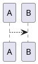

:::tip 技术要求

- vue
- npm/yarn
- git/github/gitee
- markdown
- 命令行

:::

<!-- more -->

## 安装

本博客使用的 `vuepress` 主题为 `vuepress-theme-reco` ,仅需要打开 `powershell` 或 `cmd` 在拟定要构建博客的上级目录下运行如下命令：

```bash
npx @vuepress-reco/theme-cli init
```

:::tip 提示
`npx` 要求 npm 版本大于 5.2
:::

运行完成后，按照提示依次键入信息。


之后进入新创建的博客目录,安装依赖项

```bash
cd blog-new
yarn install
# 或者使用 npm install
```

使用 `npm` 或者 `yarn` 运行脚本。

```bash
yarn dev
# 或者 npm run dev 开发模式下预览博客
yarn build
# 或者 npm run dbuild 生产模式下打包博客
```

开发模式下博客可在本地 `8080` 端口预览。至此基础安装就已经完成，剩余工作就只剩配置及部署。

## 配置

配置博客主要是对博客做功能增强和效果优化，修改 `.vuepress` 目录下的 `config.js` 即可。

### 评论功能

- [valine 评论配置参考](https://vuepress-theme-reco.recoluan.com/views/1.x/valine.html)
- [valine admin 后台搭建](https://vuepress-theme-reco.recoluan.com/views/other/valine-admin.html)

### markdown 增强

**plantuml**

`plantuml` 是一种文本绘图语言，可以按照规范将文本渲染成图形。如：

```plaintext
@startuml

A-->B

@enduml
```

渲染为：



`vuepress` 可使用 `markdown-it` 插件对 `markdown` 解析做增强，需要安装插件后，在 `config.js` `extendMarkdown` 项中配置。

**安装插件**

命令行运行：

```bash
yarn add markdown-it-plantuml-ex
```

**修改配置**

```js
extendMarkdown: (md) => {
  md.set({ breaks: true });
  md.use(require("markdown-it-plantuml-ex"));
};
```

**latex 数学公式支持**

将 `latex` 语法转化为数学公式，如

```plaintext
$$
sin^2\alpha + cos^2\bate = 1
$$
```

渲染为：

$$
sin^2\alpha + cos^2\alpha = 1
$$

与 `plantuml` 相同安装配置即可。

```bash
yarn add markdown-it-mathjax3
```

```js
extendMarkdown: (md) => {
  md.set({ breaks: true });
  md.use(require("markdown-it-plantuml-ex"));
  md.use(require("markdown-it-mathjax3"));
};
```

## 书写

博客文档在 `blog` 目录下，文档在 `docs` 目录下。书写时要在内容前添加 `Front Matters` 信息。完整信息如下：

```markdown
---
<!-- 标题 -->
title: 烤鸭的做法
<!-- 日期 -->
date: 2019-08-08
<!-- 侧边栏 -->
sidebar: 'auto'
<!-- 分类 -->
categories:
 - 烹饪
 - 爱好
 <!-- 标签 -->
tags:
 - 烤
 - 鸭子
<!-- 密码 -->
keys:
 - '123456'
<!-- 是否发布 -->
publish: false
---
```

[Front Matters 参考](https://vuepress-theme-reco.recoluan.com/views/1.x/frontMatter.html)

## 部署

本博客使用自动部署，可先参考：

:::warning 必读
[GitHub Actions 入门教程](http://www.ruanyifeng.com/blog/2019/09/getting-started-with-github-actions.html)
[使用 GitHub Actions 自动部署博客](https://vuepress-theme-reco.recoluan.com/views/other/github-actions.html)
[Gitee Pages Action 使用说明](https://github.com/marketplace/actions/gitee-pages-action)  
:::

个人 `GitHub Actions` 如下：

```yaml
# Actions名
name: Build and Deploy
# 监听事件：主分支 push create delete
on:
  push:
    branches:
      - main
  delete:
    branches:
      - main
  create:
    branches:
      - main
# 部署任务
jobs:
  deploy:
    runs-on: ubuntu-latest
    steps:
      # 签出代码
      - name: Checkout 🛎️
        uses: actions/checkout@v2.3.1
        with:
          persist-credentials: false
        # 安装依赖及构建
      - name: Install and Build 🔧
        run: |
          yarn install
          yarn build
        # 部署至 github pages
      - name: Deploy 🚀
        uses: JamesIves/github-pages-deploy-action@3.6.2
        with:
          GITHUB_TOKEN: ${{ secrets.ACCESS_TOKEN }}
          BRANCH: gh-pages
          FOLDER: public
          CLEAN: true
    # 同步至gitee仓库
  sync:
    needs: deploy
    runs-on: ubuntu-latest
    steps:
      - name: Sync to Gitee
        uses: wearerequired/git-mirror-action@master
        env:
          SSH_PRIVATE_KEY: ${{ secrets.SSH_PRIVATE_KEY }}
        with:
          source-repo: "git@github.com:xifan2333/xifan2333.github.io.git"
          destination-repo: "git@gitee.com:xifan233/xifan233.git"
        #gitee 仓库自动构建部署
      - name: Build Gitee Pages
        uses: yanglbme/gitee-pages-action@master
        with:
          gitee-username: xifan233
          gitee-password: ${{ secrets.GITEE_PASSWORD }}
          gitee-repo: xifan233/xifan233
          branch: gh-pages
          https: true
```

本篇未能基础详细地列出技术细节，但基础的内容基本都已列举在超链接中，如有疑问，请留言或自行搜索。
