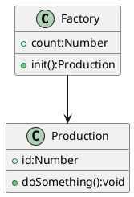

## 工厂模式

- 将 new 操作单独封装
- 遇到 new 时,就要考虑是否该使用工厂模式

## 类图



## 代码示例

```js
class Production {
  constructor(id) {
    this.id = id;
  }
  doSomething() {
    console.log(`Production ${this.id} do something……`);
  }
}

class Factory {
  constructor() {
    this.count = 0;
  }
  product() {
    this.count++;
    return new Production(this.count);
  }
}

let f = new Factory();
let p1 = f.product();
console.log(p1.doSomething());
let p2 = f.product();
console.log(p2.doSomething());
```


## 场景示例

### jQuery 选择器实现

```html
<p>1</p>
<p>2</p>
<p>3</p>
<p>4</p>
<p>5</p>
```

```js
class jQuery{
    constructor(selector){
        this.selector = selector || ''
        let doms = [...(document.querySelectorAll(selector))] || []
        for(let i=0;i<doms.length;i++){
            this[i] = doms[i]
        }
        this.length = doms.length  
    }
}

window.$ = function(selector){
    return new jQuery(selector)
}

console.log($('p'));
```


