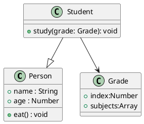

:::tip 摘要

1. 类图用来描述类、类属性和类关系
2. js 中常见的实例关系有**泛化**（继承）及 **关联** （引用）

:::

<!-- more -->

## 什么是类图

> 类图是软件工程的统一建模语言一种静态结构图，该图描述了系统的类集合，类的属性和类之间的关系。

## 类图的规范

### 概述


- 首行：类名
- 次行：属性
- 末行：方法

### 成员

- `+` public
- `-` privite
- `#` protected

### 实例关系

`js` 中常用的类关系有：**泛化**和**关联**。

**泛化（Generalization）**，即继承关系，`⇨` 空心箭头指向父类。

**关联** 即引用关系，`→` 实心箭头指向被引用类。

## 使用 plantuml 画图

```plaintext
@startuml
class Person {
  +name : String
  +age : Number
  +eat() : void
}
class Student {
  +study(grade: Grade): void
}

class Grade {
  +index:Number
  +subjects:Array
}

Student --|> Person
Student --> Grade
@enduml
```


---
[🏡 plantuml 类图官方教程 ](https://plantuml.com/zh/class-diagram)
