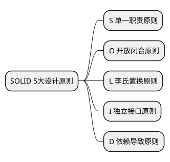

---
title: 程序设计原则
date: 2020-10-14
categories:
- 👨‍💻 编程
tags:
- 设计模式
--- 

<!-- more -->

## SOLID 五大设计原则

### S 单一职责原则

- 一个程序只做好一件事
- 如果功能过于复杂就拆分开,每个部分保持独立

### O 开放闭合原则

- 对扩展开放,对修改封闭
- 增加需求时,扩展新代码,而非修改已有代码

### L 李氏置换原则

- 子类能覆盖父类
- 父类能出现的地方子类就能出现
- JS中使用较少(弱类型&继承使用较少)

### I 独立接口原则

- 保持接口的单一独立,避免出现“胖接口
- JS中没有接口( typescript例外),使用较少

### D 依赖导致原则

- 面向接口编程,依赖于抽象而不依赖于具体
- 使用方只关注接口而不关注具体类的实现
- JS中使用较少(没有接口&弱类型)
