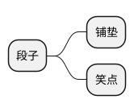
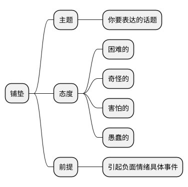
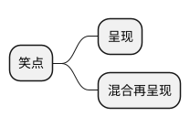

:::warning 提示
本篇需**掌握**
如果读不懂请先跳至案例教学再学习理论
:::

一个段子，一般由两部分构成：铺垫和笑点。铺垫是为抖出笑点创造的背景或前提，笑点即让观众发出笑声的地方。笑点的英文为 `punchline` `punch` 有击、打的意思，所以大多数情况下笑点应该如出拳，简短直接。相声术语说："这包袱脆"，这块的脆，也是干脆直接的意思。关于铺垫和笑点的创作《喜剧圣经》与《手把手教你玩脱口秀》所教授的是两个不同的体系，我们逐个来说。

## 喜剧圣经

### 铺垫

喜剧圣经的创作技巧，更注重逻辑的荒谬，由逻辑荒谬不断放大制造不和谐使得观众发笑。所以其铺垫一般是：

> 铺垫 = 主题 + 态度 + 前提

- 主题：你要讲述的话题
- 态度：一般为 4 种负面情绪：困难的、奇怪的、害怕的、愚蠢的。
- 前提：引起负面情绪的具体小事

总的来说，铺垫要表达的是：关于(主题)我感到（难/怪/怕/蠢）的是（前提）

### 笑点

创造笑点的方式一般有两种：呈现和混合再呈现。呈现就是基于铺垫将荒谬的行为表演出来，混合再呈现是将荒谬的行为放到更荒谬的场景中表演荒谬行为，从而放大荒谬点。常用的混合技巧便是类比和假设。

### 案例教学

<video controls>
    <source src="https://media.xifan.fun/videos/%E4%B9%B0%E8%8D%AF-%E5%91%A8%E5%A5%87%E5%A2%A8.mp4" type="video/mp4">
</video>

:::tip 结构拆解
**铺垫：** 关于没钱怕被骗钱我感到奇怪的是去药店店员总不给我拿我想要的药。
**呈现：** 店员不给我药的荒谬行为
**混合再呈现：** 如果我与店员迂回产生的荒谬行为
:::

## 手把手教你玩脱口秀

### 铺垫与笑点

手把手教你玩脱口秀注重的是预期违背。铺垫用于创建给观众制造思维定势的故事 1，笑点是打破思维定势的故事 2。总结起来是：铺垫制造预期，笑点打破预期。

关于预期违背，可以从王勉这首歌里体会下。

### 案例教学

<video controls>
    <source src="https://media.xifan.fun/videos/%E9%81%97%E6%86%BE-%E7%8E%8B%E5%8B%89.mp4" type="video/mp4">
</video>

## 总结

喜剧圣经所提供的创作路径总结起来是：

:::tip 创作路径

- 发现荒谬
- 展示荒谬
- 混合放大荒谬

:::

相对来说这套理论，创作出的段子逻辑比较通畅，预期违背，由于要不断的打破思维，会让段子的逻辑比较波折。

新人写预期违背的段子，意料之外很容易做到，但往往达不到情理之中。当然，强如王勉，能把违背的预期都圆回来，这段当我没说。

我个人比较推荐喜剧圣经的理论体系。预期违背也可在许局圣经的理论体系下使用，一般用来把铺垫拆成小梗。

能耐不足，水平有限，如有谬误，各位指正：）
